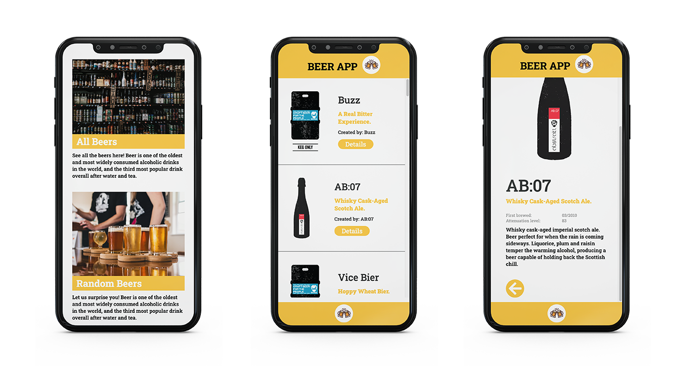

# React Beer App API

The task of the project was to create a beer app using an API. The following points should be considered:

- A navbar that is always displayed when you are not on the home page. This leads back to the home page
- Creating an additional link that leads to the detail page of the beer!
- Creating a "random beer" - page. Here we should use the random endpoint of the API. The structure of the page is like the detail page.

## Demo

https://cinalselin-react-beer-app.netlify.app/

## Screenshots

